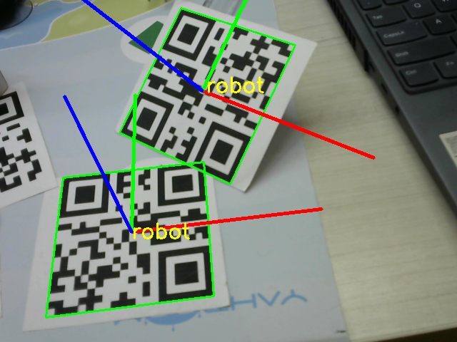

# QR Code Detection and Pose Estimation
This program uses pyzbar to detect QR codes in a video stream from a camera and OpenCV to estimate the pose of the detected QR codes and display the results.



## Prerequisites
To run this program, you'll need to have the following installed:

- Python 3.x
- OpenCV-Python
- Pyzbar
- NumPy

You can install the required libraries with the following command:

```sh
pip install opencv-python pyzbar numpy
```

Additionally, you may need to install zbar tools,

```sh
sudo apt-get install zbar-tools
```
## Installation
Clone this repository or download the source code to your local machine.

```ss
git clone https://github.com/JojiJoseph/QR-Code-3D-Pose-Estimation.git
```
Navigate to the directory where you downloaded the code.

## Usage
Run the program with the following command:

```sh
python qr_code_pose_estimation.py --video video_path/or/index_of_camera
```

Press 'q' to quit the program.

## Features
QR Code Detection: Detects QR codes in real-time using the camera feed.

Pose Estimation: Estimates the pose of the detected QR code relative to the camera and draws frame axes on the QR code.

Real-Time Display: Shows the processed video stream with the detected QR code and its pose in a window.

## How It Works
The program captures video from the specified camera index.

Each frame is processed to detect QR codes. If a QR code is found, its data is printed to the console.

It calculates a pseudo camera matrix based on the size of the video frame. (Edit and use the camera matrix of your camera).

The program then uses solvePnP to estimate the pose of the QR code.

The pose and the QR code's frame axes are drawn onto the video frame.

The processed video frame is displayed in a window.

## TODO

- Pass camera intrinsics
- Pass dimension of the QR code (currently hard coded)


<!-- License
This project is open-sourced under the MIT License.

Contributing
Contributions are welcome. Please open an issue first to discuss what you would like to change or add. -->

